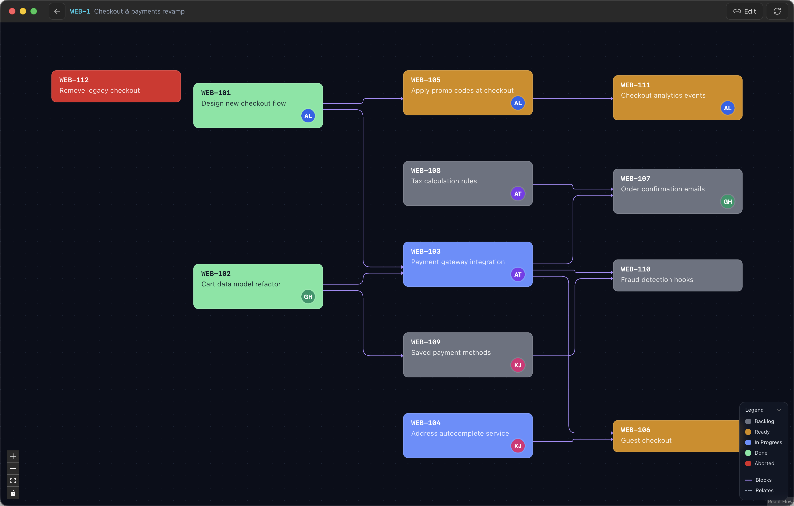
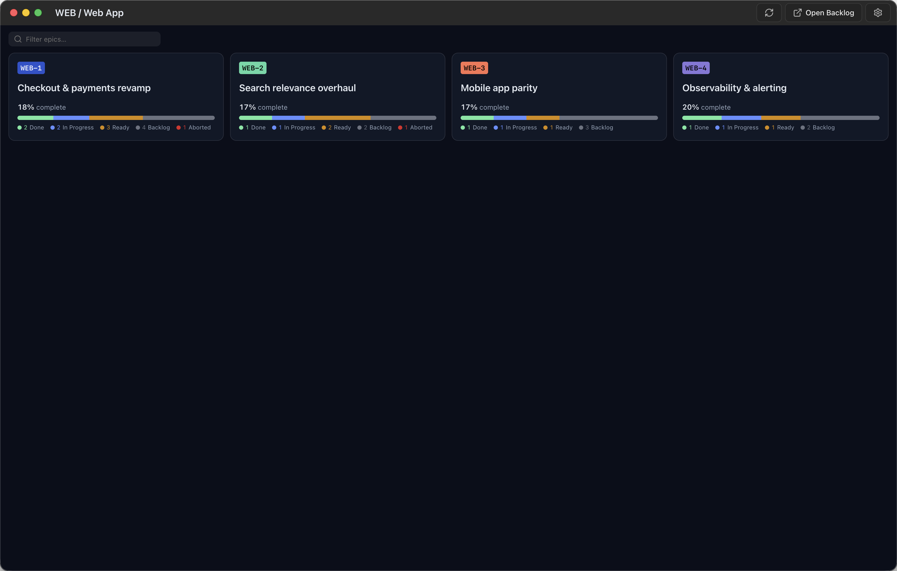
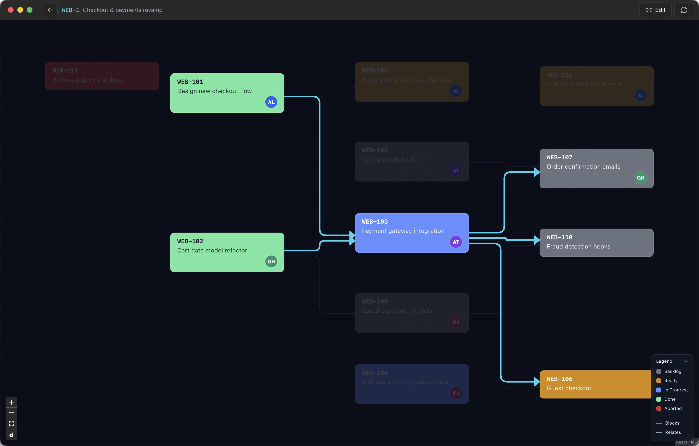
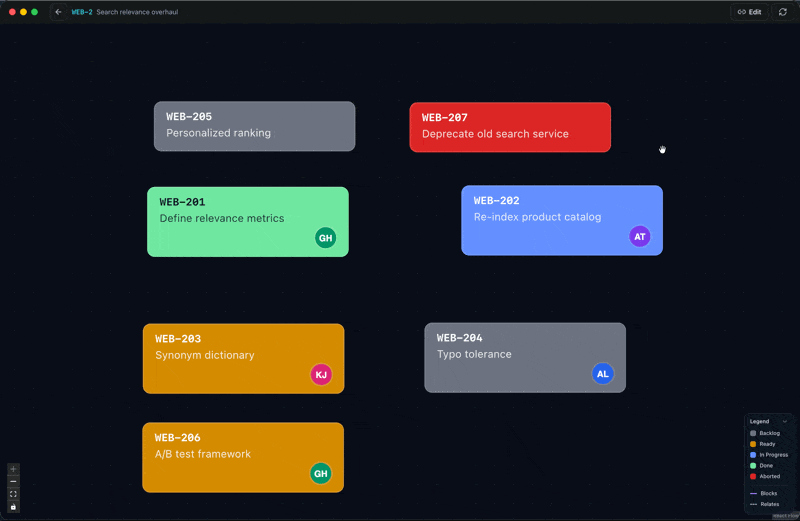

# Jira Visualizer

Jira is great at tracking individual tickets and bad at showing how they connect.
The "blocks" and "blocked by" links are all there — but only as text inside each
ticket, so a team planning an epic never sees the whole picture at once: what's
parallelizable, what's stuck behind a blocker, and what order the work should go
in.

Jira Visualizer gives the team that missing picture: an epic laid out as one
dependency graph, color-coded by status. See what's blocking what in seconds,
reshape dependencies right in the graph, and click any ticket to jump back to it
in Jira.

  

It's a self-contained desktop app: download the signed, notarized `.dmg`, drag it
to Applications, and connect with your own Atlassian credentials. No shared
secrets, no server, no GitHub login.

## Install & use

1. **Download & install** — open **[Releases](../../releases/latest)** and grab
   the dmg for your Mac:
   - `Jira-Visualizer-<version>-arm64.dmg` — Apple Silicon (M-series)
   - `Jira-Visualizer-<version>.dmg` — Intel

   (Not sure which? Apple menu →  **About This Mac**.) Open the dmg and drag
   **Jira Visualizer** to Applications. It's signed and notarized by Apple, so it
   opens with no security warnings.
2. **Connect** — click **Connect** and enter your Atlassian site URL
   (`https://yourcompany.atlassian.net`), your email, an API token
   ([create one](https://id.atlassian.com/manage-profile/security/api-tokens)),
   and the Jira project key to visualize.
3. **Explore** — pick an epic from the dashboard to open its dependency graph.
   Hover a ticket to highlight its links; click it to open it in Jira.
4. **Edit (optional)** — if you can link issues in Jira, drag from one ticket to
   another to add a "Blocks" link, or right-click to manage links.
5. **Stay current** — the app updates itself: new versions download in the
   background and prompt you to restart.

## Features

### 📊 Epic dashboard

See every epic at a glance, each with a colored breakdown of its tickets across
**Backlog, Ready, In Progress, Done,** and **Aborted**. Hide the epics you don't
care about to keep the view focused.

  

### 🔗 Dependency graph

Open an epic to explore its tickets as an automatically-laid-out map. Tickets are
colored by status and show their assignee; arrows show what blocks what. **Hover**
a ticket to highlight everything connected to it, and **click** any ticket to jump
straight to it in Jira.

  

### ✏️ Edit dependencies

Add or remove "Blocks" links right in the graph: **drag** from one ticket to
another to link them, or **right-click** to pick. Changes save to Jira instantly,
with one-click Undo. Editing is opt-in and only appears if you have permission to
link issues in Jira.

  

### 🖥️ Native feel

A Refresh button reconciles with Jira on demand, the app follows your macOS
light/dark appearance, and it keeps itself up to date in the background.

### 🔒 Your credentials stay yours

Each person connects with **their own** Atlassian API token, encrypted at rest by
the macOS keychain. The app talks directly to the Jira Cloud REST API as you —
there are no shared secrets and nothing is sent anywhere but Jira.

---

_Build artifacts only — the application source is maintained in a separate private repository._
